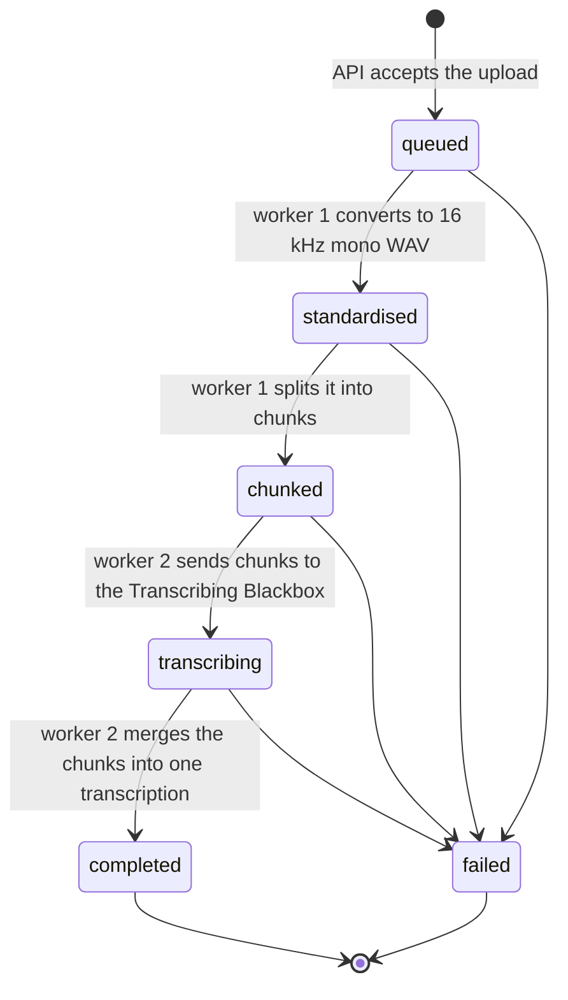

# Transcription Pipeline

Upload an audio file and get back a transcript with timestamps for each segment.

**Status: complete.** Every part of the pipeline is built and tested end to end.

```bash
docker compose up -d        # Redis, RedisInsight and the Transcribing Blackbox
npm install && npm run dev  # the API on :3000 + service worker 1 + service worker 2
curl -F "file=@talk.mp3;type=audio/mpeg" http://localhost:3000/jobs     # → 202 {job_id, status: "queued"}
curl http://localhost:3000/jobs/<job_id>/status                         # poll until "completed" → transcription
```

### The journey of one file

| # | Who | What happens | Job status afterwards |
|---|---|---|---|
| 1 | API (`POST /jobs`) | saves the upload, creates the job record, queues it on `job_processing`, replies 202 with the `job_id` | `queued` |
| 2 | Service worker 1 | ffmpeg converts it to a 16 kHz mono WAV; the original is deleted | `standardised` |
| 3 | Service worker 1 | finds the pauses, cuts ~30 s chunks between words, creates a chunk record for each, queues each one on `chunk_processing` | `chunked` |
| 4 | Service worker 2 | for each chunk in order: sends it to the **Transcribing Blackbox** (faster-whisper + WhisperX), shifts its timestamps by the chunk's start time, saves it | `transcribing` |
| 5 | Service worker 2 | once all chunks are done: merges them into one transcription and saves it on the job record | `completed` |
| 6 | API (`GET /status`) | the next poll returns `{language, duration, text, segments}` | |

If any step gives up after 3 attempts, the job is `failed`, and `stage` (`standardise`, `chunk` or `transcribe`) plus `error` say what broke.

How the task's parts map to this: **Part 1** = step 1 and `/status`; **Part 2** = steps 2–3; **Part 3** = step 4; **Part 4 (merging back)** = steps 5–6.

---

There are six running pieces:

| Piece | What it does | How it runs |
|---|---|---|
| **Express API** | Receives uploads, saves files, creates jobs, answers status requests | started by `npm run dev`, port 3000 |
| **Service worker 1** | Takes jobs from the queue, standardises the audio with ffmpeg, cuts it into chunks and queues them | started by `npm run dev`, as its own process |
| **Service worker 2** | Takes chunks from the queue in order, sends each to the Blackbox, saves the transcript; merges a job's chunks once they're all done | started by `npm run dev`, as its own process |
| **Transcribing Blackbox** | Python HTTP service: audio in, transcript JSON out (faster-whisper + WhisperX) | Docker container, port 8000 |
| **Redis** | Stores the job and chunk records and the `job_processing` / `chunk_processing` queues | Docker container, port 6379 |
| **RedisInsight** | Web UI for looking at what's inside Redis. Optional, just for debugging. | Docker container, http://localhost:5540 |

---

### Job status lifecycle
The upload sets `queued` (not `started`), because at that point the job is only waiting in the queue and no work has started. The workers then move the job forward: service worker 1 sets `standardised` and then `chunked` (or `failed` if it gives up). Service worker 2 then sets `transcribing` while the chunks are transcribed, and `completed` once they are merged (or `failed` if a chunk gives up).

Chunks have their own, simpler status in their chunk record: `not_started` (worker 1) → `processing` → `completed`, or `failed` (worker 2).


---

## Code map

```
transcription-pipeline/
├── docker-compose.yml                Redis, RedisInsight and Transcribing Blackbox containers
├── blackbox/                         the Transcribing Blackbox (Python, runs in Docker)
│   ├── app.py                        FastAPI: POST /transcribe → faster-whisper + WhisperX → JSON
│   ├── requirements.txt              whisperx, fastapi, uvicorn, python-multipart
│   └── Dockerfile                    python:3.11-slim + ffmpeg + CPU torch
├── package.json                      dependencies and npm scripts
├── storage/                          created automatically, not in git
│   ├── uploads/                      uploaded audio files (deleted once standardised)
│   ├── standardised/                 <job_id>.wav, 16 kHz mono, written by service worker 1
│   ├── chunks/<job_id>/              000.wav, 001.wav, ...: the chunks, written by service worker 1
│   └── transcripts/<job_id>/         000.json, 001.json, ...: one transcript per chunk, written by service worker 2
└── src/
    ├── server.js                     entry point: creates the Express app, mounts routes, starts listening
    ├── config.js                     settings: port, folders, chunking + pause detection, Blackbox URL, max upload size, Redis URL
    ├── controllers/
    │   └── jobs.controller.js        the endpoints: POST /jobs, GET /jobs/:job_id/status
    ├── middlewares/
    │   └── error-handler.middleware.js   turns thrown errors into JSON error responses
    ├── services/
    │   ├── jobs.js                   job records in Redis: createJob / getJob / updateJob / deleteJob
    │   └── chunks.js                 chunk records in Redis: createChunk / getChunk / updateChunk
    ├── redis/
    │   ├── redis.js                  Redis connections: redis (shared) and workerRedis (for workers)
    │   ├── job-queue.js              the job_processing queue (BullMQ)
    │   └── chunk-queue.js            the chunk_processing queue (BullMQ)
    ├── utils/
    │   ├── upload.js                 saveAudioFile(req, res): saves the uploaded file with multer
    │   ├── ffmpeg.js                 ffmpeg/ffprobe: standardiseAudio, getDuration, detectSilences, cutChunk
    │   ├── chunking.js               planChunks(): decides where to cut (plain arithmetic)
    │   ├── blackbox.js               transcribe(chunk_path): POSTs a chunk to the Transcribing Blackbox
    │   └── transcript.js             offsetTimestamps() + mergeTranscripts(): chunk times → file times, chunks → one transcription
    └── workers/
        ├── job-processing.worker.js  service worker 1: job_processing → standardised WAV → chunks → chunk_processing
        └── chunk-processing.worker.js  service worker 2: chunk_processing → Blackbox → JSON per chunk → merge → job completed
```

What each layer is responsible for:

| Folder | Role
|---|---|
| `controllers/` | Handles a request from start to finish: checks it, calls the helpers in order, sends the response |
| `middlewares/` | Runs around the routes; the error handler catches anything a route throws |
| `services/` | Business data: reading and writing job and chunk records |
| `redis/` | Infrastructure: the Redis connections and the queues |
| `utils/` | Reusable helpers: saving an uploaded file to disk, running ffmpeg, planning chunks, calling the Blackbox, offsetting and merging transcripts | only `upload.js` reads the request |
| `workers/` | Background processes: take jobs from a queue and process them, step by step |


---

## Requirements to run it

 Node 20+, Docker Desktop and ffmpeg (`brew install ffmpeg`).

```bash
npm install
docker compose up -d     # start Redis, RedisInsight and the Transcribing Blackbox (first build is slow)
npm run dev              # starts the API (http://localhost:3000), service worker 1 AND service worker 2
```
`npm run dev` uses the `concurrently` package to start **three separate processes** with one command. Their log lines are prefixed `[api]`, `[worker1]` and `[worker2]`. They restart when you edit files, and Ctrl+C stops all three.

| Script | What it starts |
|---|---|
| `npm run dev` | API + both workers, restarting when you edit files (what you normally use) |
| `npm run api` | only the API |
| `npm run worker:1` | only service worker 1 (e.g. to run a second one) |
| `npm run worker:2` | only service worker 2 |
| `npm start` | API + both workers, without restarting on edits |

They're kept as separate processes on purpose: a slow ffmpeg conversion never slows down the API, and more workers can be started (even on another machine) without touching the API.

Upload an audio file as form-data, in a field called `file` (in Postman: Body → form-data, key `file`, type File). With curl:
```bash
curl -i -F "file=@/path/to/song.mp3;type=audio/mpeg" http://localhost:3000/jobs
```
```
HTTP/1.1 202 Accepted
Location: /jobs/6c00a623-.../status
{"job_id":"6c00a623-...","status":"queued"}
```

Poll the status:
```bash
curl http://localhost:3000/jobs/6c00a623-.../status
```

---