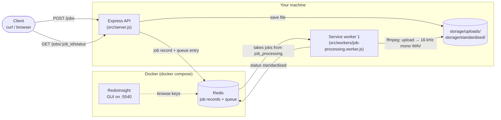
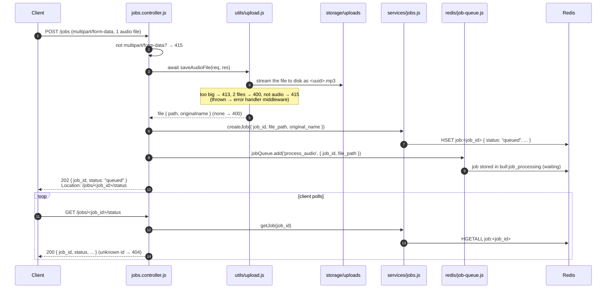
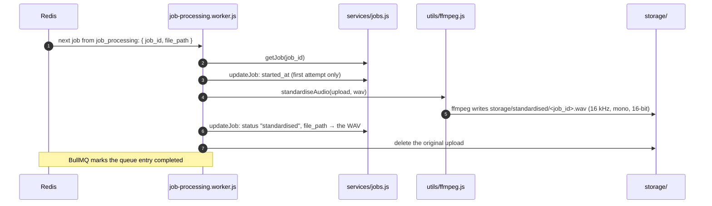
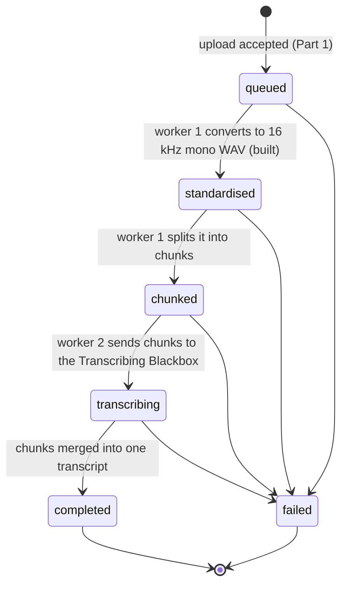
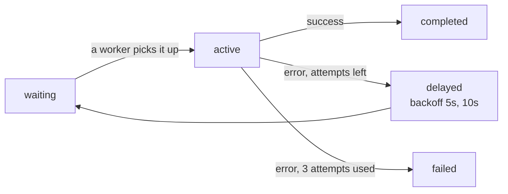
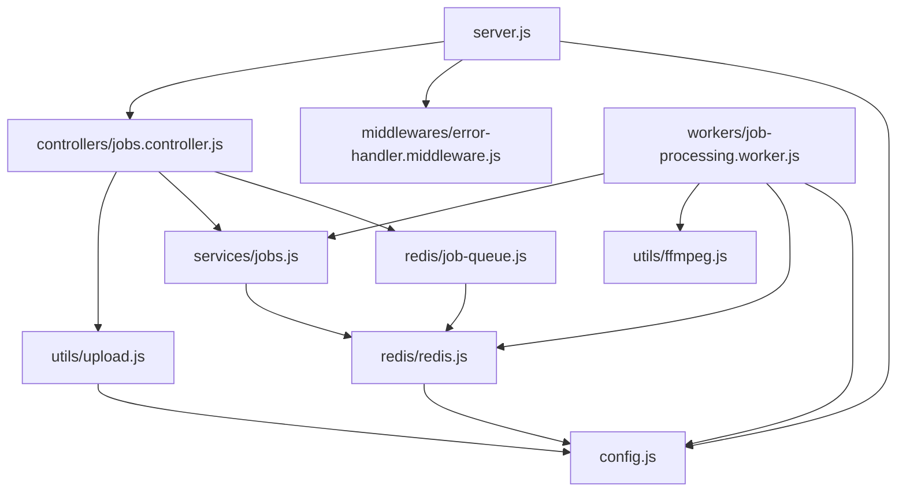
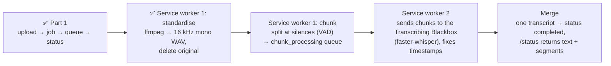

# Transcription Pipeline

Upload an audio file and get back a transcript with timestamps for each segment.

The project is built step by step. **What exists so far:**
- **Part 1:** an upload endpoint that saves the audio file to disk, creates a job, puts the job on a message queue, and lets the client poll the job's status.
- **Part 2 (so far):** service worker 1 takes jobs from the queue, converts each file to a standardised 16 kHz mono WAV, and deletes the original.

Chunking, transcription and merging come in later steps.

---

## 1. The big picture



There are four running pieces:

| Piece | What it does | How it runs |
|---|---|---|
| **Express API** | Receives uploads, saves files, creates jobs, answers status requests | started by `npm run dev`, port 3000 |
| **Service worker 1** | Takes jobs from the queue and standardises the audio with ffmpeg | started by `npm run dev`, as its own process |
| **Redis** | Stores the job records and the `job_processing` queue | Docker container, port 6379 |
| **RedisInsight** | Web UI for looking at what's inside Redis. Optional, just for debugging. | Docker container, http://localhost:5540 |

---

## 2. What happens when a file is uploaded



**If Redis is down** when the job record or the queue entry is created, the API deletes the job record and the saved file, so nothing is left half-created, and returns `503 QUEUE_UNAVAILABLE`. The client can simply try again.

---

## 3. Service worker 1: standardising the audio

Service worker 1 is a **separate Node process** from the API. `npm run dev` starts both together. It waits on the `job_processing` queue and handles one job at a time:



The ffmpeg command it runs (in `src/utils/ffmpeg.js`):
```bash
ffmpeg -hide_banner -loglevel error -y -i <upload> -vn -ac 1 -ar 16000 -c:a pcm_s16le storage/standardised/<job_id>.wav
#                                                   no video, mono, 16 kHz, 16-bit WAV
```

**Why the order matters.** The original upload is deleted only *after* the job record points at the WAV. If the worker crashes at any step, the audio is never lost: either the upload still exists, or the WAV does and the record says so.

**When it fails** (for example, the file isn't really audio), the worker throws, and BullMQ retries it after 5 s and then 10 s. While retries are left, the status stays `queued`. After the 3rd failed attempt, the job record gets `status: "failed"`, `stage: "standardise"` and ffmpeg's error message, which `/status` shows. The original upload is kept, so the failure can be investigated.

**A retry after success.** If the record already says `standardised`, the worker skips the job, so nothing is converted twice.

**Its Redis connection.** A BullMQ Worker waits for jobs with a *blocking* Redis command. That needs a connection that never gives up on a command (`maxRetriesPerRequest: null`), so the worker uses `workerRedis` instead of the API's fail-fast `redis` connection; both are in `src/redis/redis.js`.

ffmpeg is called directly with Node's `child_process.spawn`, not through `fluent-ffmpeg`. That library is no longer maintained, and with spawn the exact command is visible in the code.

---

## 4. Two things in Redis: the job record and the queue

These are easy to mix up, so here they are side by side:

| | Job record | Queue entry |
|---|---|---|
| Redis key | `job:<job_id>` (a hash) | `bull:job_processing:<job_id>`, plus the `bull:job_processing:wait` list |
| Created by | `src/services/jobs.js` | `src/redis/job-queue.js` (the BullMQ library) |
| Purpose | Remembers the job's **status** for the client | **Delivers work** to a worker |
| Contents | `job_id, status, file_path, original_name, created_at, updated_at`, plus `started_at` from worker 1 and `stage, error` on failure | `{job_id, file_path}` |
| Read by | `GET /jobs/:job_id/status` | Service worker 1 |
| Lifetime | Stays after the job finishes | BullMQ removes it once the job is done |

A good analogy is a restaurant:
- The **queue** is the ticket rail in the kitchen. Tickets wait there until a cook (a worker) takes one. Once the dish is done, the ticket is thrown away.
- The **job record** is the order on the waiter's notepad. It tracks where the order is, and it's what you check when the customer asks "is my food ready?".

### Job status lifecycle
The upload sets `queued` (not `started`), because at that point the job is only waiting in the queue and no work has started. The workers then move the job forward: service worker 1 sets `standardised` (and `failed` if it gives up); the later steps are still to be built.
Each status is in the past tense and means that step has **finished**. For example, `standardised` means the 16 kHz mono WAV already exists. While worker 1 is still converting, the status stays `queued`, but worker 1 sets `started_at` on the record when it picks the job up, so `/status` shows the job is in progress.

Don't confuse the status with the queue entry's name. Every queue entry is named `process_audio`, which only describes the kind of work. The status is always read from the job record.



### How a queue entry moves through BullMQ
Inside the queue, BullMQ tracks each job with its own states. These describe *delivery*, not our business status:


If the worker isn't running (e.g. you started only `npm run api`), new jobs stay in **waiting**. They're picked up as soon as the worker starts.

---

## 5. Code map

```
transcription-pipeline/
├── docker-compose.yml                Redis + RedisInsight containers
├── package.json                      dependencies and npm scripts
├── storage/                          created automatically, not in git
│   ├── uploads/                      uploaded audio files (deleted once standardised)
│   └── standardised/                 <job_id>.wav, 16 kHz mono, written by service worker 1
└── src/
    ├── server.js                     entry point: creates the Express app, mounts routes, starts listening
    ├── config.js                     settings: port, folders, max upload size, Redis URL
    ├── controllers/
    │   └── jobs.controller.js        the endpoints: POST /jobs, GET /jobs/:job_id/status
    ├── middlewares/
    │   └── error-handler.middleware.js   turns thrown errors into JSON error responses
    ├── services/
    │   └── jobs.js                   job records in Redis: createJob / getJob / updateJob / deleteJob
    ├── redis/
    │   ├── redis.js                  Redis connections: redis (shared) and workerRedis (for workers)
    │   └── job-queue.js              the job_processing queue (BullMQ)
    ├── utils/
    │   ├── upload.js                 saveAudioFile(req, res): saves the uploaded file with multer
    │   └── ffmpeg.js                 standardiseAudio(input, output): runs ffmpeg
    └── workers/
        └── job-processing.worker.js  service worker 1: job_processing queue → standardised WAV
```

What each layer is responsible for:

| Folder | Role | Knows about HTTP? |
|---|---|---|
| `controllers/` | Handles a request from start to finish: checks it, calls the helpers in order, sends the response | yes |
| `middlewares/` | Runs around the routes; the error handler catches anything a route throws | yes |
| `services/` | Business data: reading and writing job records | no |
| `redis/` | Infrastructure: the Redis connection and the queue | no |
| `utils/` | Reusable helpers: saving an uploaded file to disk, running ffmpeg | only `upload.js` reads the request |
| `workers/` | Background processes: take jobs from a queue and process them, step by step | no |

How the files import each other:



Reading the upload endpoint top to bottom tells the whole story:

```js
jobsRouter.post('/', async (req, res) => {
  if (!req.is('multipart/form-data')) return 415;            // 1. right request type?
  const file = await saveAudioFile(req, res);                // 2. save the file (throws → 413/400/415)
  if (!file) return 400;
  const job_id = randomUUID();
  await createJob({ job_id, file_path, original_name });     // 3. job record, status "queued"
  await jobQueue.add('process_audio', { job_id, file_path });  // 4. queue it for service worker 1
  res.status(202).json({ job_id, status: 'queued' });        // 5. reply (Redis down → 503 instead)
});
```

## 6. Running it

**Requirements:** Node 20+, Docker Desktop and ffmpeg (`brew install ffmpeg`).

```bash
npm install
docker compose up -d     # start Redis and RedisInsight
npm run dev              # starts the API (http://localhost:3000) AND service worker 1
```
`npm run dev` uses the `concurrently` package to start **two separate processes** with one command. Their log lines are prefixed `[api]` and `[worker]`. Both restart when you edit files, and Ctrl+C stops both.

| Script | What it starts |
|---|---|
| `npm run dev` | API + worker, restarting when you edit files (what you normally use) |
| `npm run api` | only the API |
| `npm run worker` | only service worker 1 (e.g. to run a second worker) |
| `npm start` | API + worker, without restarting on edits |

They're kept as separate processes on purpose: a slow ffmpeg conversion never slows down the API, and more workers can be started (even on another machine) without touching the API.

Upload a file. With curl, set the type, otherwise curl sends `application/octet-stream` and the API rejects it:
```bash
curl -i -F "file=@/path/to/song.mp3;type=audio/mpeg" http://localhost:3000/jobs
```
```
HTTP/1.1 202 Accepted
Location: /jobs/6c00a623-.../status
{"job_id":"6c00a623-...","status":"queued"}
```

Poll the status:
```bash
curl http://localhost:3000/jobs/6c00a623-.../status
```
```json
{"job_id":"6c00a623-...","status":"standardised","original_name":"song.mp3","created_at":"...","started_at":"...","updated_at":"..."}
```
With the worker running, a ~6-minute mp3 is standardised in about a second. The WAV is in `storage/standardised/<job_id>.wav`.

Settings can be changed with environment variables, e.g. `PORT=4000 MAX_UPLOAD_MB=100 npm run dev`.

---

## 7. API reference

### `POST /jobs`
Send exactly one audio file as `multipart/form-data`. Any form field name works.

| Situation | Response |
|---|---|
| Accepted | **202** `{job_id, status: "queued"}` + `Location` header |
| Body isn't multipart/form-data | **415** `UNSUPPORTED_MEDIA_TYPE` |
| File isn't audio (mimetype not `audio/*`) | **415** `UNSUPPORTED_FILE_TYPE` |
| More than one file | **400** `TOO_MANY_FILES` |
| No file | **400** `FILE_REQUIRED` |
| Bigger than `MAX_UPLOAD_MB` (default 500) | **413** `FILE_TOO_LARGE` |
| Redis unavailable | **503** `QUEUE_UNAVAILABLE` |

### `GET /jobs/:job_id/status`
| Situation | Response |
|---|---|
| Job exists | **200** `{job_id, status, original_name, created_at, started_at, updated_at}`. `started_at` appears once worker 1 has picked the job up. A `failed` job also has `stage` and `error`. |
| Unknown id | **404** `JOB_NOT_FOUND` |

Every error has the same shape: `{"error": {"code": "...", "message": "..."}}`.

---

## 8. Looking inside Redis

After an upload, Redis contains:

| Key | Type | What it is |
|---|---|---|
| `job:<job_id>` | hash | our job record (status lives here) |
| `bull:job_processing:<job_id>` | hash | the queue entry: `name` (`process_audio`, a label for the kind of work, **not** the status), `data` (`{job_id, file_path}`), `opts` (retry settings) |
| `bull:job_processing:wait` | list | ids of jobs waiting for a worker |
| `bull:job_processing:active` / `:completed` / `:failed` | list / sorted sets | jobs the worker is processing / has finished / gave up on |
| `bull:job_processing:events` | stream | history of queue events (`added`, …) |
| `bull:job_processing:meta`, `:id`, `:marker` | various | BullMQ internals; ignore these |

**Option A: RedisInsight (GUI)**
1. Open http://localhost:5540 → **Connect existing database**.
2. Host: **`redis`**, port **6379**. Use `redis`, not `localhost`: RedisInsight runs inside Docker, where Redis is reachable by its service name. The URL form is `redis://default@redis:6379`.
3. Open the database → **Browse**. Switch to tree view to see the keys grouped under `bull › job_processing` and `job`.

**Option B: redis-cli (terminal)**
```bash
docker compose exec redis redis-cli
HGETALL job:<job_id>                   # the job record
LRANGE bull:job_processing:wait 0 -1   # job ids waiting in the queue
HGETALL bull:job_processing:<job_id>   # the queue entry
MONITOR                                # live view of every command — upload a file and watch
```

### Docker settings (docker-compose.yml)
| Setting | Why |
|---|---|
| `--appendonly yes` | Redis also writes every change to disk, so queued jobs survive a restart. |
| `--maxmemory-policy noeviction` | Required by BullMQ: when memory is full, Redis returns an error instead of silently deleting keys (which could include queued jobs). |
| volume `redis-data` | Data lives in a Docker volume, so it survives `docker compose down`. Only `docker compose down -v` deletes it. |
| healthcheck | Docker Desktop shows the container as *healthy* once Redis answers `PING`. |

---

## 9. What's next


