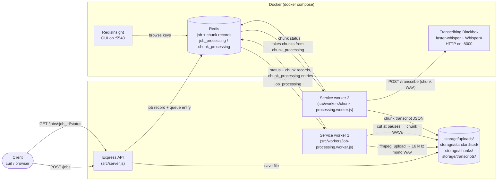
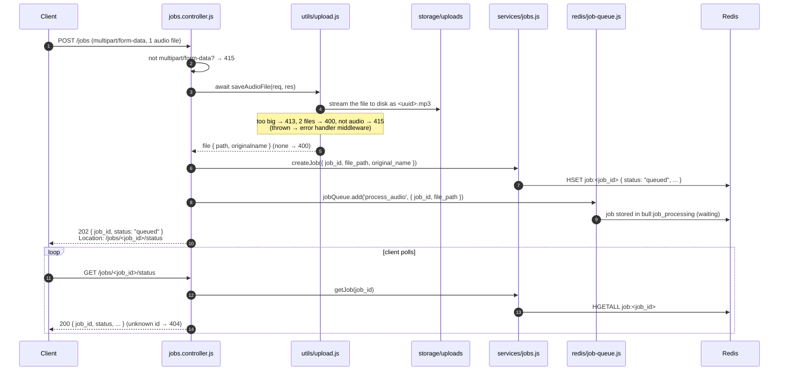
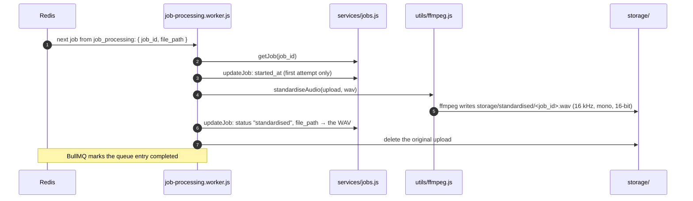
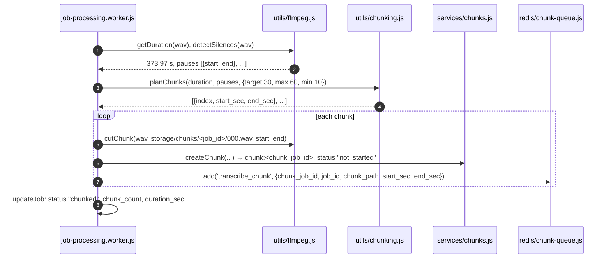
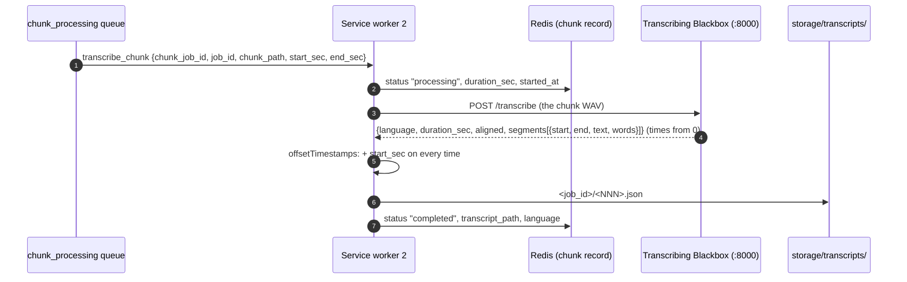
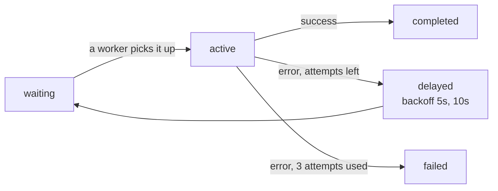
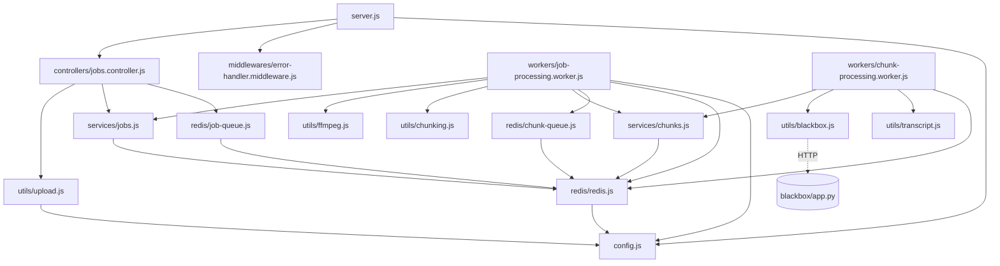
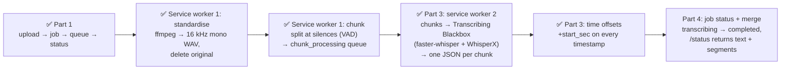

# Transcription Pipeline

Upload an audio file and get back a transcript with timestamps for each segment.

The project is built step by step. **Status: Parts 1, 2 and 3 are done; Part 4 (job status + merging the chunks into one transcript) is next.**
- **Part 1:** an upload endpoint that saves the audio file to disk, creates a job, puts the job on a message queue, and lets the client poll the job's status.
- **Part 2:** service worker 1 takes jobs from the queue, converts each file to a standardised 16 kHz mono WAV, deletes the original, cuts the WAV into chunks at the pauses, and puts every chunk on the `chunk_processing` queue.

- **Part 3:** service worker 2 takes the chunks off `chunk_processing` in order, sends each one to the **Transcribing Blackbox** (faster-whisper + WhisperX in Docker), shifts the returned timestamps by the chunk's start time, and saves one transcript per chunk.

Still to come (Part 4): the job's `transcribing` / `completed` status, and merging the chunks into one transcript that `/status` returns.

---

## 1. The big picture



There are six running pieces:

| Piece | What it does | How it runs |
|---|---|---|
| **Express API** | Receives uploads, saves files, creates jobs, answers status requests | started by `npm run dev`, port 3000 |
| **Service worker 1** | Takes jobs from the queue, standardises the audio with ffmpeg, cuts it into chunks and queues them | started by `npm run dev`, as its own process |
| **Service worker 2** | Takes chunks from the queue in order, sends each to the Blackbox, saves the transcript | started by `npm run dev`, as its own process |
| **Transcribing Blackbox** | Python HTTP service: audio in, transcript JSON out (faster-whisper + WhisperX) | Docker container, port 8000 |
| **Redis** | Stores the job and chunk records and the `job_processing` / `chunk_processing` queues | Docker container, port 6379 |
| **RedisInsight** | Web UI for looking at what's inside Redis. Optional, just for debugging. | Docker container, http://localhost:5540 |

---

## 2. What happens when a file is uploaded



**If Redis is down** when the job record or the queue entry is created, the API deletes the job record and the saved file, so nothing is left half-created, and returns `503 QUEUE_UNAVAILABLE`. The client can simply try again.

---

## 3. Service worker 1: standardise, then chunk

Service worker 1 is a **separate Node process** from the API. `npm run dev` starts both together. It waits on the `job_processing` queue and handles one job at a time, in two halves: **standardise** (steps 1–4) and **chunk** (steps 5–8).

### 3a. Standardising



The ffmpeg command it runs (in `src/utils/ffmpeg.js`):
```bash
ffmpeg -hide_banner -loglevel error -y -i <upload> -vn -ac 1 -ar 16000 -c:a pcm_s16le storage/standardised/<job_id>.wav
#                                                   no video, mono, 16 kHz, 16-bit WAV
```

**Why the order matters.** The original upload is deleted only *after* the job record points at the WAV. If the worker crashes at any step, the audio is never lost: either the upload still exists, or the WAV does and the record says so.

**When it fails** (for example, the file isn't really audio), the worker throws, and BullMQ retries it after 5 s and then 10 s. While retries are left, the status stays `queued`. After the 3rd failed attempt, the job record gets `status: "failed"`, `stage: "standardise"` and ffmpeg's error message, which `/status` shows. The original upload is kept, so the failure can be investigated.

Why is the WAV smaller than the mp3, even though WAV is uncompressed? A 320 kbps stereo mp3 is 40 KB per second. A 16 kHz mono 16-bit WAV is 16000 × 2 bytes = 32 KB per second, so it holds less data than the mp3.

**Its Redis connection.** A BullMQ Worker waits for jobs with a *blocking* Redis command. That needs a connection that never gives up on a command (`maxRetriesPerRequest: null`), so the worker uses `workerRedis` instead of the API's fail-fast `redis` connection; both are in `src/redis/redis.js`.

ffmpeg is called directly with Node's `child_process.spawn`, not through `fluent-ffmpeg`. That library is no longer maintained, and with spawn the exact command is visible in the code.

### 3b. Chunking at the pauses

A long recording is cut into short pieces, so service worker 2 can transcribe them in parallel. The cuts go in the **natural pauses**, so no word is cut in half.



**Finding the pauses (VAD).** ffmpeg's `silencedetect` filter lists every stretch quieter than **-30 dB** that lasts at least **0.2 s**:
```bash
ffmpeg -i <wav> -af silencedetect=noise=-30dB:d=0.2 -f null -    # prints silence_start / silence_end lines
```
It measures loudness rather than recognising speech, but in speech a quiet gap always falls **between words**, so a cut there never splits a word. A sentence may still be split across two chunks; that's fine, because merging joins the chunks back together.

Why 0.2 s and not 0.5 s: fast speakers barely pause. In `audio.mp3` (690 s of talking) only 22 gaps last 0.5 s, and whole minutes had none, so 4 chunks fell back to a hard cut at 60 s, which can land mid-word. At 0.2 s there are 241 gaps, a few seconds apart, so the hard cut is no longer needed for speech.

**Choosing the cuts** (`planChunks` in `src/utils/chunking.js`, plain arithmetic with no files involved):
- Each chunk aims for **30 s** (Whisper works in 30 s windows) and is **never longer than 60 s** or (except the last one) **shorter than 10 s**.
- Among the pauses that fall in that range, it cuts in the **middle of the pause closest to 30 s**.
- **No pause in range** (music, or non-stop talking)? It cuts at 60 s anyway, so no chunk is ever too long.

Two real examples:

| Audio | Pauses found | Chunks |
|---|---|---|
| speech-like test (tone with 2 s pauses at 25–27, 52–54, 94–96 s) | 3 | `0–26`, `26–53`, `53–95`, `95–116`: every cut is inside a pause |
| `mehmaan.mp3`, a song (374 s) | almost none | `0–14.8` (a pause), then 60 s fallback cuts: 7 chunks in total |
| `audio.mp3`, fast speech (690 s) | 241 | 22 chunks of 28–33 s (the last one 59 s), every cut between two whole words, no 60 s fallback cuts. With 0.5 s it was 16 chunks, 4 of them hard cuts. |

**Each chunk gets** a WAV file, a record and a queue entry:

| | Where | Contents |
|---|---|---|
| Audio | `storage/chunks/<job_id>/000.wav`, `001.wav`, … | the slice, cut exactly on the sample, so the timestamps line up |
| Chunk record | `chunk:<chunk_job_id>` (hash) | `chunk_job_id, job_id, chunk_index, chunk_path, start_sec, end_sec, status: "not_started"` |
| Queue entry | `bull:chunk_processing:<chunk_job_id>` | name `transcribe_chunk`, data `{chunk_job_id, job_id, chunk_path, start_sec, end_sec}` |

- **`chunk_job_id = <job_id>-000`, `-001`, …** It's built from the job and the chunk's position, so if worker 1 crashes halfway and BullMQ retries, the same ids come out again. BullMQ ignores an `add` with an id it already has, and the record is simply overwritten, so a retry never creates duplicate chunks.
- **`start_sec` travels with the chunk**, so worker 2 can turn a chunk's timestamps back into timestamps of the whole file (chunk time + `start_sec`).
- **The status lives in the chunk record**, not in the queue entry: the same split as jobs (see section 5).
- **Retries skip finished work.** The worker looks at the job's status: `queued` → do everything; `standardised` → chunk only; `chunked` → nothing left to do. When the last attempt fails, `stage` says which half broke (`standardise` or `chunk`).
- The standardised WAV is **kept** after chunking (the spec doesn't ask for it to be deleted, and it helps debugging).

---

## 4. Service worker 2: transcribe each chunk

Service worker 2 (`src/workers/chunk-processing.worker.js`) is a third process, also started by `npm run dev`. It takes the chunks off `chunk_processing` and sends each one to the **Transcribing Blackbox**.



1. Load the chunk record. If it's already `completed` (a retry after success), stop.
2. Set the status to `processing` and store the chunk's length, `duration_sec = end_sec - start_sec`.
3. Send the WAV to the Blackbox (`utils/blackbox.js`, using Node's built-in `fetch` + `FormData`, with a 5-minute timeout).
4. **Time offset adjustment** (`utils/transcript.js`): add the chunk's `start_sec` to every segment and word time.
5. Save the adjusted JSON as `storage/transcripts/<job_id>/<NNN>.json`, with the same number as the chunk WAV.
6. Set the status to `completed`, plus `transcript_path` and `language`.

- **Linear order:** `concurrency: 1`, and BullMQ hands out entries first in, first out, so chunks are done 000, 001, 002, … in the order worker 1 queued them. One exception: a chunk that fails waits 5–10 s before its retry, and the next chunks carry on meanwhile. That's harmless, because every saved time is already on the whole file's timeline and merging orders the chunks by `chunk_index`.
- **Which chunks it takes:** every chunk except one that is already `completed`. New chunks arrive as `not_started`; a chunk left in `processing` by a crashed worker is picked up again by BullMQ's retry.
- **Failures:** 3 attempts with backoff (5 s, 10 s). After the last one, the chunk is `failed` with an `error`, e.g. `Transcribing Blackbox unreachable at http://localhost:8000 (ECONNREFUSED)`.
- **Why the offset is needed:** the Blackbox only sees one chunk, so its times always start at 0. Adding the chunk's `start_sec` puts them on the whole file's timeline:

  | File | Chunk covers | Blackbox times | Saved times |
  |---|---|---|---|
  | `000.json` | 0 → 39.117 s | 0.211 … | 0.211 … (offset 0, unchanged) |
  | `001.json` | 39.117 → 72.198 s | 0.291 … | 39.408 … |

  This works because worker 1 cuts the chunks back to back: each chunk's `start_sec` is the sum of the lengths (`duration_sec`) of the chunks before it. Each saved file also records its `offset_sec`. Words WhisperX couldn't align keep `null` times.

### The Transcribing Blackbox (`blackbox/`)

A small Python service in Docker. Audio goes in, JSON comes out, and it knows nothing about jobs or Redis.

| File | What it is |
|---|---|
| `blackbox/app.py` | FastAPI app: `GET /health`, `POST /transcribe` |
| `blackbox/requirements.txt` | `whisperx` (brings faster-whisper and torch), `fastapi`, `uvicorn`, `python-multipart` |
| `blackbox/Dockerfile` | `python:3.11-slim` + ffmpeg + CPU-only torch |

For each request it:
1. **Transcribes** with **faster-whisper** (run through WhisperX). The model is loaded once at startup and the language is detected per chunk. This gives segments with rough times.
2. **Aligns** with **WhisperX** (a wav2vec2 model for that language), which gives accurate **word-level** times. Alignment models are loaded the first time a language comes up. If a language has none, the segments are kept as they are and `aligned` is `false`.

```bash
docker compose up -d --build blackbox            # first time: slow (large image + model download)
curl localhost:8000/health                       # {"ok":true,"model":"small"}
curl -F file=@storage/chunks/<job_id>/000.wav localhost:8000/transcribe
```

Settings (in `docker-compose.yml`): `WHISPER_MODEL` (`small` by default; `tiny`/`base` are faster, `medium`/`large-v3` more accurate), `COMPUTE_TYPE=int8`, `DEVICE=cpu`. The models are cached in the `hf-cache` volume.

**Why an HTTP service and not a Python script per chunk?**
- The model loads once and stays in memory. Loading it for every chunk would cost seconds each time.
- The Node side stays simple: one `fetch`.
- In production it becomes its own GPU deployment, scaled independently of the workers.
- Docker keeps Python 3.11 and torch off the host machine.

---

## 5. Two things in Redis: the job record and the queue

These are easy to mix up, so here they are side by side:

| | Job record | Queue entry |
|---|---|---|
| Redis key | `job:<job_id>` (a hash) | `bull:job_processing:<job_id>`, plus the `bull:job_processing:wait` list |
| Created by | `src/services/jobs.js` | `src/redis/job-queue.js` (the BullMQ library) |
| Purpose | Remembers the job's **status** for the client | **Delivers work** to a worker |
| Contents | `job_id, status, file_path, original_name, created_at, updated_at`, plus `started_at`, `duration_sec`, `chunk_count` from worker 1 and `stage, error` on failure | `{job_id, file_path}` |
| Read by | `GET /jobs/:job_id/status` | Service worker 1 |
| Lifetime | Stays after the job finishes | BullMQ removes it once the job is done |

The same split applies to chunks: the **chunk record** `chunk:<chunk_job_id>` holds the chunk's status, and the **queue entry** `bull:chunk_processing:<chunk_job_id>` delivers it to service worker 2.

A good analogy is a restaurant:
- The **queue** is the ticket rail in the kitchen. Tickets wait there until a cook (a worker) takes one. Once the dish is done, the ticket is thrown away.
- The **job record** is the order on the waiter's notepad. It tracks where the order is, and it's what you check when the customer asks "is my food ready?".

### Job status lifecycle
The upload sets `queued` (not `started`), because at that point the job is only waiting in the queue and no work has started. The workers then move the job forward: service worker 1 sets `standardised` and then `chunked` (or `failed` if it gives up). `transcribing` and `completed` come with Part 4.

Chunks have their own, simpler status in their chunk record: `not_started` (worker 1) → `processing` → `completed`, or `failed` (worker 2).

Each status is in the past tense and means that step has **finished**. For example, `standardised` means the 16 kHz mono WAV already exists. While worker 1 is still converting, the status stays `queued`, but worker 1 sets `started_at` on the record when it picks the job up, so `/status` shows the job is in progress.

Don't confuse the status with the queue entry's name. Every queue entry is named `process_audio`, which only describes the kind of work. The status is always read from the job record.


### How a queue entry moves through BullMQ
Inside the queue, BullMQ tracks each job with its own states. These describe *delivery*, not our business status:


If the worker isn't running (e.g. you started only `npm run api`), new jobs stay in **waiting**. They're picked up as soon as the worker starts.

---

## 6. Code map

```
transcription-pipeline/
├── docker-compose.yml                Redis, RedisInsight and Transcribing Blackbox containers
├── blackbox/                         the Transcribing Blackbox (Python, runs in Docker)
│   ├── app.py                        FastAPI: POST /transcribe → faster-whisper + WhisperX → JSON
│   ├── requirements.txt              whisperx, fastapi, uvicorn, python-multipart
│   └── Dockerfile                    python:3.11-slim + ffmpeg + CPU torch
├── package.json                      dependencies and npm scripts
├── storage/                          created automatically, not in git
│   ├── uploads/                      uploaded audio files (deleted once standardised)
│   ├── standardised/                 <job_id>.wav, 16 kHz mono, written by service worker 1
│   ├── chunks/<job_id>/              000.wav, 001.wav, ...: the chunks, written by service worker 1
│   └── transcripts/<job_id>/         000.json, 001.json, ...: one transcript per chunk, written by service worker 2
└── src/
    ├── server.js                     entry point: creates the Express app, mounts routes, starts listening
    ├── config.js                     settings: port, folders, max upload size, Redis URL
    ├── controllers/
    │   └── jobs.controller.js        the endpoints: POST /jobs, GET /jobs/:job_id/status
    ├── middlewares/
    │   └── error-handler.middleware.js   turns thrown errors into JSON error responses
    ├── services/
    │   ├── jobs.js                   job records in Redis: createJob / getJob / updateJob / deleteJob
    │   └── chunks.js                 chunk records in Redis: createChunk / getChunk / updateChunk
    ├── redis/
    │   ├── redis.js                  Redis connections: redis (shared) and workerRedis (for workers)
    │   ├── job-queue.js              the job_processing queue (BullMQ)
    │   └── chunk-queue.js            the chunk_processing queue (BullMQ)
    ├── utils/
    │   ├── upload.js                 saveAudioFile(req, res): saves the uploaded file with multer
    │   ├── ffmpeg.js                 ffmpeg/ffprobe: standardiseAudio, getDuration, detectSilences, cutChunk
    │   ├── chunking.js               planChunks(): decides where to cut (plain arithmetic)
    │   ├── blackbox.js               transcribe(chunk_path): POSTs a chunk to the Transcribing Blackbox
    │   └── transcript.js             offsetTimestamps(): shifts a chunk's times by its start_sec (plain arithmetic)
    └── workers/
        ├── job-processing.worker.js  service worker 1: job_processing → standardised WAV → chunks → chunk_processing
        └── chunk-processing.worker.js  service worker 2: chunk_processing → Blackbox → transcript JSON per chunk
```

What each layer is responsible for:

| Folder | Role | Knows about HTTP? |
|---|---|---|
| `controllers/` | Handles a request from start to finish: checks it, calls the helpers in order, sends the response | yes |
| `middlewares/` | Runs around the routes; the error handler catches anything a route throws | yes |
| `services/` | Business data: reading and writing job and chunk records | no |
| `redis/` | Infrastructure: the Redis connections and the queues | no |
| `utils/` | Reusable helpers: saving an uploaded file to disk, running ffmpeg, planning chunks, calling the Blackbox | only `upload.js` reads the request |
| `workers/` | Background processes: take jobs from a queue and process them, step by step | no |

How the files import each other:



Reading the upload endpoint top to bottom tells the whole story:

```js
jobsRouter.post('/', async (req, res) => {
  if (!req.is('multipart/form-data')) return 415;            // 1. right request type?
  const file = await saveAudioFile(req, res);                // 2. save the file (throws → 413/400/415)
  if (!file) return 400;
  const job_id = randomUUID();
  await createJob({ job_id, file_path, original_name });     // 3. job record, status "queued"
  await jobQueue.add('process_audio', { job_id, file_path });  // 4. queue it for service worker 1
  res.status(202).json({ job_id, status: 'queued' });        // 5. reply (Redis down → 503 instead)
});
```

## 7. Running it

**Requirements:** Node 20+, Docker Desktop and ffmpeg (`brew install ffmpeg`).

```bash
npm install
docker compose up -d     # start Redis, RedisInsight and the Transcribing Blackbox (first build is slow)
npm run dev              # starts the API (http://localhost:3000), service worker 1 AND service worker 2
```
`npm run dev` uses the `concurrently` package to start **three separate processes** with one command. Their log lines are prefixed `[api]`, `[worker1]` and `[worker2]`. They restart when you edit files, and Ctrl+C stops all three.

| Script | What it starts |
|---|---|
| `npm run dev` | API + both workers, restarting when you edit files (what you normally use) |
| `npm run api` | only the API |
| `npm run worker:1` | only service worker 1 (e.g. to run a second one) |
| `npm run worker:2` | only service worker 2 |
| `npm start` | API + both workers, without restarting on edits |

They're kept as separate processes on purpose: a slow ffmpeg conversion never slows down the API, and more workers can be started (even on another machine) without touching the API.

Upload a file. With curl, set the type, otherwise curl sends `application/octet-stream` and the API rejects it:
```bash
curl -i -F "file=@/path/to/song.mp3;type=audio/mpeg" http://localhost:3000/jobs
```
```
HTTP/1.1 202 Accepted
Location: /jobs/6c00a623-.../status
{"job_id":"6c00a623-...","status":"queued"}
```

Poll the status:
```bash
curl http://localhost:3000/jobs/6c00a623-.../status
```
```json
{"job_id":"6c00a623-...","status":"chunked","original_name":"song.mp3","created_at":"...","started_at":"...","updated_at":"...","duration_sec":373.97,"chunk_count":7}
```
With the worker running, a 6-minute mp3 is standardised and chunked in about a second. The WAV is in `storage/standardised/<job_id>.wav` and the chunks in `storage/chunks/<job_id>/`.

Settings can be changed with environment variables, e.g. `PORT=4000 MAX_UPLOAD_MB=100 npm run dev`. The chunking settings are `CHUNK_TARGET_SEC`, `CHUNK_MAX_SEC`, `CHUNK_MIN_SEC`, `SILENCE_NOISE_DB` and `SILENCE_MIN_SEC`; worker 2 uses `BLACKBOX_URL` (default `http://localhost:8000`), `BLACKBOX_TIMEOUT_MS` and `TRANSCRIPTS_DIR` (see `src/config.js`).

---

## 8. API reference

### `POST /jobs`
Send exactly one audio file as `multipart/form-data`. Any form field name works.

| Situation | Response |
|---|---|
| Accepted | **202** `{job_id, status: "queued"}` + `Location` header |
| Body isn't multipart/form-data | **415** `UNSUPPORTED_MEDIA_TYPE` |
| File isn't audio (mimetype not `audio/*`) | **415** `UNSUPPORTED_FILE_TYPE` |
| More than one file | **400** `TOO_MANY_FILES` |
| No file | **400** `FILE_REQUIRED` |
| Bigger than `MAX_UPLOAD_MB` (default 500) | **413** `FILE_TOO_LARGE` |
| Redis unavailable | **503** `QUEUE_UNAVAILABLE` |

### `GET /jobs/:job_id/status`
| Situation | Response |
|---|---|
| Job exists | **200** `{job_id, status, original_name, created_at, started_at, updated_at, duration_sec, chunk_count}`. Fields appear as the job progresses: `started_at` once worker 1 picks it up, `duration_sec` and `chunk_count` once it's chunked. A `failed` job also has `stage` (`standardise` or `chunk`) and `error`. |
| Unknown id | **404** `JOB_NOT_FOUND` |

Every error has the same shape: `{"error": {"code": "...", "message": "..."}}`.

---

## 9. Looking inside Redis

After an upload, Redis contains:

| Key | Type | What it is |
|---|---|---|
| `job:<job_id>` | hash | our job record (status lives here) |
| `bull:job_processing:<job_id>` | hash | the queue entry: `name` (`process_audio`, a label for the kind of work, **not** the status), `data` (`{job_id, file_path}`), `opts` (retry settings) |
| `bull:job_processing:wait` | list | ids of jobs waiting for a worker |
| `bull:job_processing:active` / `:completed` / `:failed` | list / sorted sets | jobs the worker is processing / has finished / gave up on |
| `chunk:<chunk_job_id>` | hash | a chunk record: `status` (`not_started` → `processing` → `completed` / `failed`), `start_sec`, `end_sec`, `chunk_path`, then `duration_sec`, `started_at`, `transcript_path`, `language` (or `error`) from worker 2 |
| `bull:chunk_processing:<chunk_job_id>` | hash | a chunk's queue entry, `name` = `transcribe_chunk` |
| `bull:chunk_processing:wait` | list | chunk ids waiting for service worker 2 |
| `bull:job_processing:events` | stream | history of queue events (`added`, …) |
| `bull:job_processing:meta`, `:id`, `:marker` | various | BullMQ internals; ignore these |

**Option A: RedisInsight (GUI)**
1. Open http://localhost:5540 → **Connect existing database**.
2. Host: **`redis`**, port **6379**. Use `redis`, not `localhost`: RedisInsight runs inside Docker, where Redis is reachable by its service name. The URL form is `redis://default@redis:6379`.
3. Open the database → **Browse**. Switch to tree view to see the keys grouped under `bull › job_processing` and `job`.

**Option B: redis-cli (terminal)**
```bash
docker compose exec redis redis-cli
HGETALL job:<job_id>                   # the job record
LRANGE bull:job_processing:wait 0 -1   # job ids waiting in the queue
HGETALL bull:job_processing:<job_id>   # the queue entry
MONITOR                                # live view of every command — upload a file and watch
```

### Docker settings (docker-compose.yml)
| Setting | Why |
|---|---|
| `--appendonly yes` | Redis also writes every change to disk, so queued jobs survive a restart. |
| `--maxmemory-policy noeviction` | Required by BullMQ: when memory is full, Redis returns an error instead of silently deleting keys (which could include queued jobs). |
| volume `redis-data` | Data lives in a Docker volume, so it survives `docker compose down`. Only `docker compose down -v` deletes it. |
| healthcheck | Docker Desktop shows the container as *healthy* once Redis answers `PING`. |

---

## 10. Design decisions

Where the code differs from the original task notes, or a choice had to be made:

| Decision | Why |
|---|---|
| A new job's status is `queued`, not `started` | Nothing has started while the job waits in the queue; it matches the submitted status list (`queued → standardised → chunked → transcribing → completed / failed`). `started_at` on the record shows when a worker picked it up. |
| Statuses live in **records** (`job:*`, `chunk:*`), not inside queue entries | BullMQ deletes queue entries once they're done, but `/status` must keep working afterwards. Queue entries only *deliver* work. |
| Queue entry names are `process_audio` / `transcribe_chunk` | BullMQ requires a name. It describes the *kind of work* and is deliberately not status-like, so it isn't confused with the status. |
| ffmpeg is called with `child_process.spawn`, not fluent-ffmpeg | fluent-ffmpeg is deprecated; with spawn the exact command is visible. |
| VAD = ffmpeg `silencedetect` (-30 dB, ≥ 0.2 s) | No extra dependencies. It measures loudness, which finds the gaps between words well. 0.2 s rather than 0.5 s, because fast speech has few 0.5 s pauses and the 60 s hard cut could split a word. Splitting a *sentence* is fine, since merging joins it. A neural VAD (e.g. Silero) would handle noisy audio and music better; overlapping chunks would remove boundary effects entirely. |
| Chunks aim for 30 s, max 60 s, with a hard cut if there's no pause | Whisper works in 30 s windows, and the max guarantees no chunk is too big. On music without pauses, a hard cut can split a word. |
| `chunk_job_id = <job_id>-000, -001, …` | Predictable ids make retries safe: BullMQ ignores a duplicate id, so no duplicate chunks are created. |
| Retries skip finished work (based on the job's status) | A crash halfway never redoes or loses work, and the original upload is deleted only after the WAV is recorded. |
| The Transcribing Blackbox is an HTTP service in Docker | The model loads once and serves every chunk; Node only needs `fetch`; it scales on its own (GPU) in production; Python/torch stay off the host. |
| Blackbox: WhisperX `small` model, int8 on CPU | The dev machine is an M1 without CUDA. `small` is a reasonable speed/accuracy trade-off on CPU; it's one env var to change. |
| Worker 2 runs with `concurrency: 1` | The spec asks for chunks in order (000, 001, …), and one CPU Blackbox can only do one chunk at a time anyway. |
| Time offset = the chunk's `start_sec`, applied by worker 2 before saving | Chunks are cut back to back, so `start_sec` is exactly where the chunk sits in the file. Every saved transcript is already on the whole file's timeline, so merging only has to concatenate in `chunk_index` order. |
| API and workers are separate processes (one `npm run dev` starts all) | A slow ffmpeg run never slows the API, and workers can be scaled on their own. |

### Running this at scale
- **API and workers would be separate deployments**, usually from the same image with a different start command.
  - The API scales with HTTP traffic.
  - The workers scale with queue length, e.g. with the KEDA autoscaler on Kubernetes.
  - ffmpeg workers need CPU machines; the Transcribing Blackbox needs GPU machines.
- **Files would move to object storage.** Right now the queue entries carry **local paths**, which only works because the API and the workers share one disk. With S3 or GCS, the API uploads the file and puts its **URL** in the queue entry, and the workers read and write object storage. This is the "uri (or path)" in the spec.
- **Redis would be a managed service** (e.g. ElastiCache). BullMQ already guarantees that each job goes to exactly one worker, and that a job is handed to another worker if its worker dies.

---

## 11. What's next


